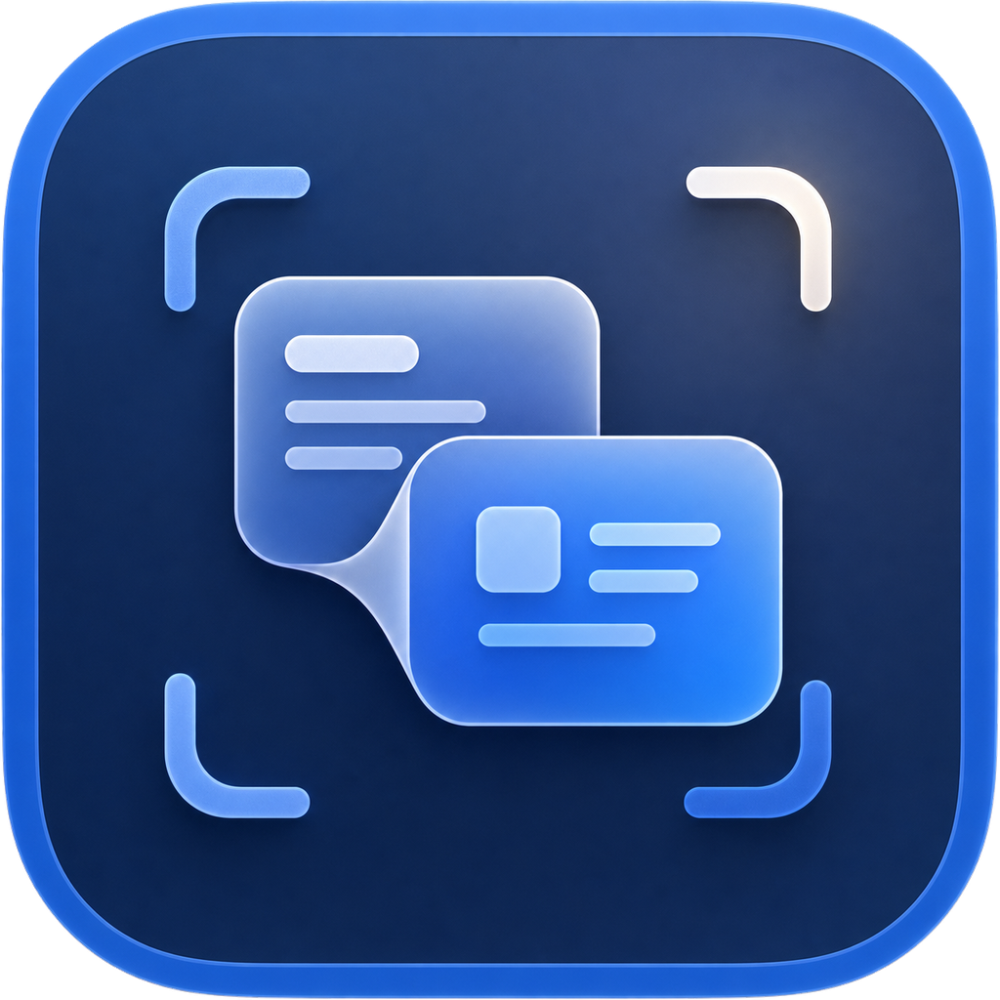

# 英见



英见是一款轻量、原生的 macOS 菜单栏截图翻译工具。

按下 `Command + Shift + T`，框选屏幕上的英文，即可通过 Vision OCR 识别文字、使用 Apple Translation Framework 翻译为简体中文，并在原位置附近显示翻译浮层。

## 功能

- macOS 菜单栏常驻，不显示 Dock 图标
- 全局快捷键 `Command + Shift + T`
- 多显示器截图选区与 `Esc` 取消
- ScreenCaptureKit 原生屏幕捕获
- Vision 英文 OCR 与多段文本分组
- Apple Translation Framework 英译简中
- 中文优先的轻量翻译浮层
- 英文原文朗读、中文复制与自动淡出
- SMAppService 开机自动启动
- 不保存截图、OCR 原文或翻译结果

首次翻译时，macOS 可能下载英语和简体中文的本地翻译语言包。

## 系统要求

- macOS 15 或更高版本
- Swift 6 工具链
- 推荐使用完整 Xcode 进行签名与发布

## 构建

```bash
chmod +x Scripts/build-app.sh
chmod +x Scripts/build-pkg.sh
chmod +x Scripts/build-zip.sh
./Scripts/build-app.sh release
./Scripts/build-zip.sh
./Scripts/build-pkg.sh
open .build/dist/英见-*.zip
open .build/dist/英见-*.pkg
```

也可以直接使用 Xcode 打开 `Package.swift`。

如果你是普通用户，推荐直接下载 GitHub Releases 里的 `英见-版本号.zip`。解压后会得到 `英见.app`，把它拖到“应用程序”文件夹即可。

如果你更喜欢免拖拽安装，也可以下载 `英见-版本号.pkg`，双击后一路继续即可自动安装到 `Applications`。

首次截图时，需要在“系统设置 → 隐私与安全性 → 屏幕与系统音频录制”中授予英见权限。

## 技术栈

- Swift / SwiftUI / AppKit
- ScreenCaptureKit
- Vision
- Translation
- NSSpeechSynthesizer
- ServiceManagement

## 隐私

英见不会保存截图、OCR 原文或翻译结果，不提供历史记录、账号系统或云同步。截图仅用于当前一次识别与翻译。

## 许可证

[MIT](LICENSE)
