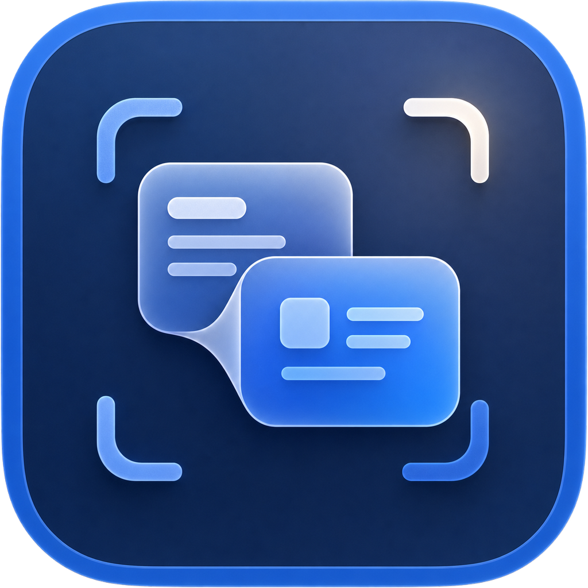
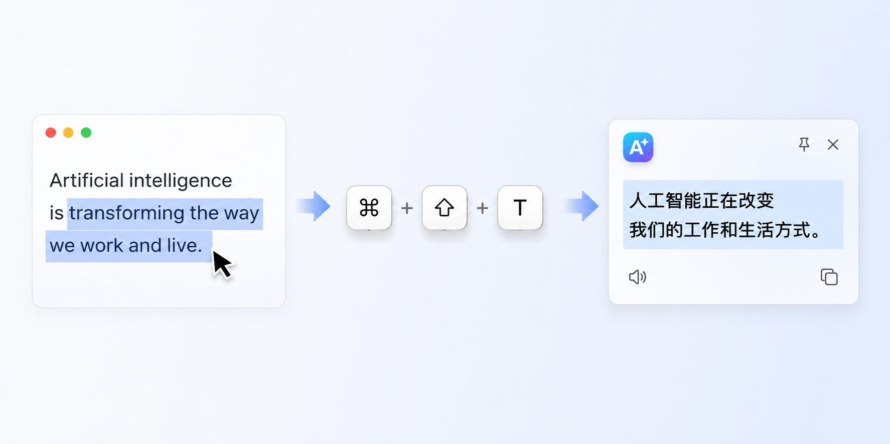

<p align="center">
  
</p>

<div align="center">
  
  <h1>英见 · YingSee</h1>
  <p><strong>看不懂的英文，框一下就懂。</strong></p>
  <p>按下快捷键，框选屏幕上的英文，中文就在原位置附近出现。默认快捷键为 <kbd>⌘</kbd> <kbd>⇧</kbd> <kbd>T</kbd>。</p>

  <p>
    <a href="https://github.com/aaabbssbaishuo-code/yingjian-macos/releases/latest/download/yingjian-latest.pkg"></a>
    
    
    <a href="LICENSE"></a>
  </p>

  <p>
    <a href="https://github.com/aaabbssbaishuo-code/yingjian-macos/releases/latest/download/yingjian-latest.pkg"><strong>下载安装包</strong></a>
    ·
    <a href="#安装公开版">安装帮助</a>
  </p>
  <p><sub>首次安装提示：如果 macOS 显示“Apple 无法验证”，请点击“完成”，再到“下载”文件夹右键安装包并选择“打开”。</sub></p>
</div>

## 它解决的不只是翻译，而是“看得见却拿不到”

软件按钮、系统弹窗和图片里的文字无法复制。鼠标一移开，悬停提示和临时气泡就会消失。为了看懂一句英文，还要截图、保存、打开翻译网站，再切回原来的工作。

英见把这件事缩短成三步：

```text
按下快捷键  →  拖拽框选英文  →  在原位置附近看中文
```

不用复制，不用上传图片，不用离开当前应用。

## 会消失的英文，也能留住再翻译

普通截图工具出现时，鼠标往往已经离开原位置，悬停提示、右键菜单和临时弹层也会随之消失。

英见会先冻结你按下快捷键那一刻的屏幕，再让你框选。眼前的菜单、提示和弹层会留在冻结画面中，直到你完成选择。

这意味着你可以直接翻译：

- Figma、开发工具和专业软件里的悬停提示（hover）
- 右键菜单、系统弹窗和错误信息
- 网页图片、视频画面和无法复制的文字

## 翻译就在眼前，用完即走

识别完成后，英见不会打开一个新窗口。中文会显示在选区附近，英文原文保留在下方，方便核对。

- 自动保留段落和阅读顺序
- 支持选择并复制英文，也可以一键复制全部原文
- 支持朗读、暂停和逐词高亮，单击单词即可听发音
- 浮层自动避让屏幕边缘，并支持多显示器

## 你的内容留在这台 Mac

英见没有账号、云同步和历史记录，也没有自己的翻译服务器。

| 数据 | 处理方式 |
| --- | --- |
| 屏幕截图 | 只在内存中用于本次识别，完成后释放，不写入文件 |
| 英文识别 | 使用 Apple Vision 在设备端完成 |
| 中文翻译 | 使用 Apple Translation；语言模型下载后由系统处理 |
| 原文与译文 | 不保存，不建立历史记录，不同步到其他设备 |

首次使用时，macOS 可能需要联网下载英语和简体中文翻译语言包。

## 下载与安装

### 系统要求

- macOS 15 Sequoia 或更高版本
- 当前公开安装包支持 Apple Silicon Mac
- 当前版本支持 **英文 → 简体中文**

> [!IMPORTANT]
> 当前公开安装包为 `v0.1.3`。主分支中的“冻结悬停提示、菜单和临时弹层”等最新改进尚未进入该安装包；要体验 README 描述的完整最新功能，请先[从源码构建](#从源码构建)。

### 安装公开版

1. 点击[直接下载最新安装包](https://github.com/aaabbssbaishuo-code/yingjian-macos/releases/latest/download/yingjian-latest.pkg)，浏览器会立即下载 `.pkg` 文件。
2. 下载完成后，右键点击 `yingjian-latest.pkg`，选择“打开”。
3. 按安装器提示继续，英见会自动安装到“应用程序”文件夹并启动。
4. 屏幕顶部菜单栏出现英见图标，即表示启动成功。

不要下载 GitHub 自动生成的 `Source code (zip)` 或 `Source code (tar.gz)`，它们是工程源码，不是安装包。

当前公开构建尚未经过 Apple Developer ID 公证。如果 macOS 提示“无法验证开发者”，请确认下载来源是本仓库，再通过“右键 `.pkg` → 打开”启动安装器。

具体操作：先点击提示中的“完成”，再到“下载”文件夹中右键点击 `yingjian-latest.pkg`，选择“打开”并再次确认。

### 首次启动

英见需要两项系统权限：

1. **屏幕与系统音频录制**：只读取你主动框选的屏幕区域。
2. **辅助功能**：用于可靠监听全局快捷键。

权限路径：`系统设置 → 隐私与安全性 → 屏幕与系统音频录制 / 辅助功能`。

授权后如果快捷键没有生效，请完全退出英见并重新打开。建议始终从“应用程序”文件夹运行，避免 macOS 将不同路径下的副本视为不同应用。

## 使用方法



1. 停留在想看懂的英文界面上，悬停提示或右键菜单可以保持打开。
2. 按下你设置的快捷键。默认快捷键为 <kbd>Command</kbd> + <kbd>Shift</kbd> + <kbd>T</kbd>。
3. 屏幕定格后，拖拽框选英文区域，松开鼠标即自动确认。
4. 中文会显示在选区附近。单击喇叭可朗读英文，单击复制按钮可复制原文。

按 <kbd>Esc</kbd> 可以随时取消。

### 自定义快捷键

打开菜单栏中的英见，选择“设置快捷键…”，然后直接按下你习惯的组合键并保存。设置会自动保留，下次启动仍然有效；也可以随时恢复默认的 <kbd>Command</kbd> + <kbd>Shift</kbd> + <kbd>T</kbd>。

## 常见问题

<details>
<summary><strong>为什么必须开启屏幕录制权限？</strong></summary>
<br>
macOS 将读取屏幕像素的行为统一放在这项权限下。英见只在你触发截图翻译时获取一次静态画面，不会持续录屏。
</details>

<details>
<summary><strong>英见会上传或保存我的截图吗？</strong></summary>
<br>
不会。截图只在内存中用于本次 OCR，完成后释放；原文和译文也不会写入历史记录。
</details>

<details>
<summary><strong>为什么第一次翻译会下载语言？</strong></summary>
<br>
Apple Translation 需要先准备英语和简体中文语言模型。下载完成后，后续翻译由系统能力处理。
</details>

<details>
<summary><strong>为什么框选时，真实应用里的悬停提示已经消失了？</strong></summary>
<br>
这是预期行为。英见在快捷键触发瞬间冻结了屏幕；你框选的是冻结副本，所以触发瞬间看到的提示仍然可以被识别。
</details>

## 给开发者

<details>
<summary><strong>原生技术栈</strong></summary>
<br>

| 能力 | Apple 原生技术 |
| --- | --- |
| 应用与界面 | Swift、SwiftUI、AppKit |
| 屏幕冻结与区域捕获 | ScreenCaptureKit |
| 英文文字识别 | Vision OCR |
| 英译简中 | Translation Framework |
| 英文朗读 | NSSpeechSynthesizer |
| 开机启动 | SMAppService |

英见不使用 Electron，也不引入大型前端框架。
</details>

### 从源码构建

需要 macOS 15+、Swift 6 工具链，推荐使用完整 Xcode。

```bash
git clone https://github.com/aaabbssbaishuo-code/yingjian-macos.git
cd yingjian-macos

chmod +x Scripts/build-app.sh Scripts/build-zip.sh Scripts/build-pkg.sh
./Scripts/build-app.sh release
open .build/英见.app
```

生成分发文件：

```bash
./Scripts/build-zip.sh
./Scripts/build-pkg.sh
open .build/dist
```

### 签名与 Apple 公证

面向普通用户公开分发时，需要 Apple Developer Program 提供的 `Developer ID Application` 和 `Developer ID Installer` 证书。先把公证凭据保存到钥匙串：

```bash
xcrun notarytool store-credentials yingjian-notary \
  --apple-id "你的 Apple ID" \
  --team-id "你的 Team ID" \
  --password "App 专用密码"
```

设置证书名称并生成已签名、公证和附加票据的安装包：

```bash
export DEVELOPER_ID_APPLICATION="Developer ID Application: Your Name (TEAMID)"
export DEVELOPER_ID_INSTALLER="Developer ID Installer: Your Name (TEAMID)"
export NOTARY_KEYCHAIN_PROFILE="yingjian-notary"
./Scripts/build-notarized-release.sh
```

脚本只有在签名、公证、票据附加和 Gatekeeper 检查全部通过后才会完成，并同时输出带版本号的安装包与稳定直链使用的 `yingjian-latest.pkg`。

也可以直接使用 Xcode 打开 `Package.swift`。

<details>
<summary><strong>项目结构</strong></summary>
<br>

```text
Sources/QuickLensTranslator/
├── AppDelegate.swift
├── CaptureCoordinator.swift
├── FloatingTranslationPanel.swift
├── HotKeyManager.swift
├── LaunchGuideService.swift
├── MenuBarController.swift
├── OCRService.swift
├── PermissionManager.swift
├── ScreenCaptureService.swift
├── ScreenshotOverlayWindow.swift
├── ShortcutRecorder.swift
├── SpeechService.swift
└── TranslationService.swift
```
</details>

## 开源许可

英见采用 [MIT License](LICENSE)。
